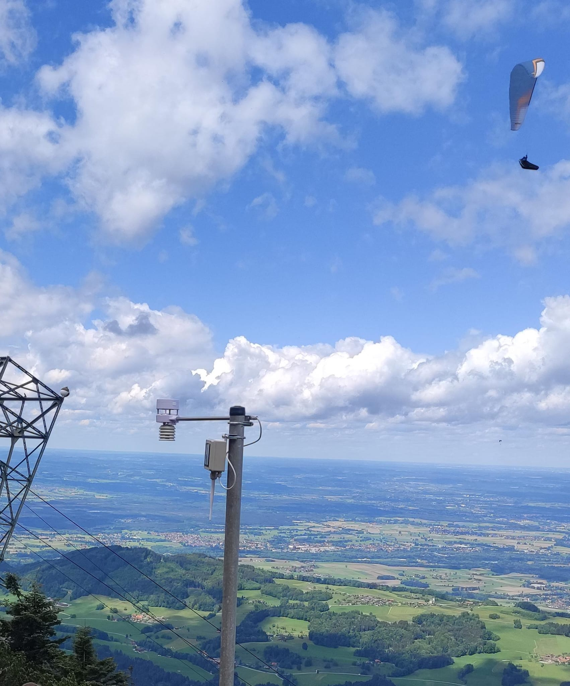
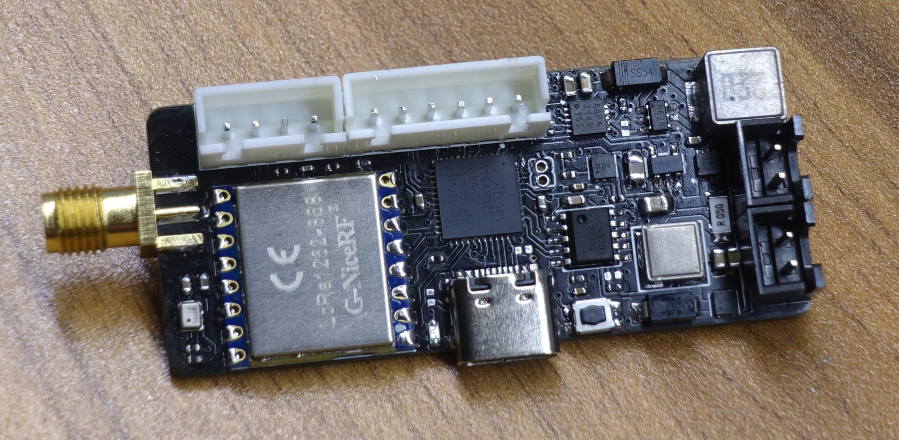

# BreezeDude
### An Open source low power FANET wind sensor.

Map of almost all wind stations: https://breezedude.de/

----

  
    
  

A low cost FANET wind station using Ecowitt WS80/WS85/WS90 ultrasonic or DAVIS 6410 analog sensor.     
USB MSC Settings file and Drag&Drop Firmware upgrade. 

- wind sensor: Ecowitt WS80/WS85/WS90 or analog with reed/potentiometer (e.g. DAVIS 6410)
- pressure sensor: BMP280 or SPL06-001
- LoRa module: RFM95W (SX1276) or G-NiceRF SX1262
- antenna connector: SMA straight, edge or u.fl
- microcontroller: SAMD21
- connectivity: USB-C, I2C, UART
- battery: 1S Li-Ion (1-3x 18650)
- solar: 4-25V MPPT buck, 2A max.
- heater: DCDC boost 4,2V-12V, max. 8W
- PCB Size: 56x24mm

Currently using 2x 18650 li-ion battery with 80x80 125mA 6V solar panel.     
Avg. power consumption at 40s send interval @3.7V battery: 0.65mA with analog sensor, 1.65mA with WS80

More info: https://breezedude.de/about.html    
Based on SMAD21 using adafruits samd core and itsybitsy M0 variant definitions and bootloader.     

FANET source based on https://github.com/gereic/GXAirCom
